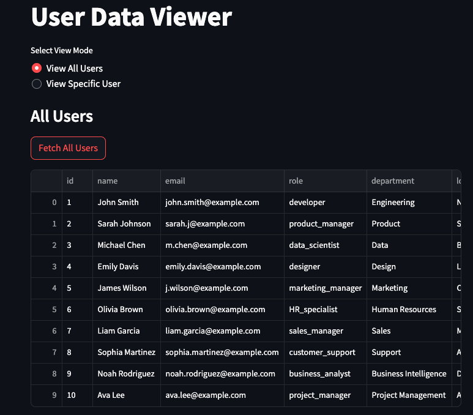
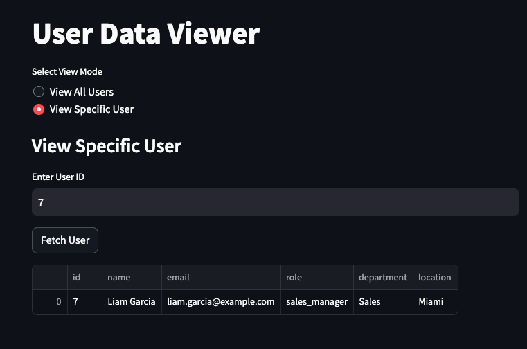

# app-app-communication

## Overview 
This repository contains the code for the app to app communication using REST APIs.

## Solution Components
Clone the repo https://github.com/sfc-gh-praj/app-app-communication

### 1. Source Application (Source_App)
- FastAPI service exposing user data through REST endpoints
- Deployed as a SPCS service using compute pools
- Provides two endpoints one with `/users/{user_id}` endpoint to fetch specific user details and one with /users to display all users.

### 2. Destination Application (Destination_App) 

- Streamlit UI for displaying user information. This streamlit is running as a service in SPCS. This can be anything which is running as a service in SPCS.
- Makes API calls to the source application over internal DNS
- Shows how to consume external app endpoints

## Implementation Steps

### Step 1: Setting Up the Source Application

- We are using snowcli to create DB objects and the image repository. You can follow [this link](https://docs.snowflake.com/en/developer-guide/snowflake-cli/installation/installation) to install and configure snowcli. Ensure you configure the [default snowflake connection](https://docs.snowflake.com/en/developer-guide/snowflake-cli/connecting/configure-connections#set-the-default-connection) for your snowcli commands to execute.
- Run the [shell script](app_app_comm/build-and-push.sh) from the root clone repo directory which will build the docker image and pushes it to the image repository which is created in the same shell script.

```bash
$ ./app_app_comm/build-and-push.sh
```

- We are using snowcli to create a native app but you create the native app using sql scripts as well.
- We are using the [this yaml file](app_app_comm/snowflake.yml) to create the source_app native application. Run the below command on your terminal to create the source native application.

```bash
snow app run
```

- Once the source app is created and permissions are granted from Snowsight UI to created compute pool and bind service endpoint, you can create the service and check the status of the service by running the below queries from snowsight UI.

```sql
-- source_app_praj is the name of the application(source appliation which will expose an rest api endpoint)

call source_app_praj.setup.create_service([]);

-- check the status of the service
call source_app_praj.setup.service_status();

-- Get the internal dns name which will be used by the destination app to fetch the user information.
call source_app_praj.setup.service_dns_name();

-- drops the service and the compute pool it has created in the source application.
call source_app_praj.setup.drop_service_and_pool();
```

### Step 2: Building the Destination Application

- This application will be a streamlit UI running in a contaniner which will be talking to the source application over the internal dns name to get the user information using the API endpoint that source application is exposing. 
- Run the [shell script](app_app_comm/build-and-push.sh) from the root clone repo directory which will build the docker image and pushes it to the image repository which is created in the same shell script. Update the IMAGE_NAME and DIR_NAME as mentioned in the shell script for creating docker images used by the destination application.

```bash
$ ./app_app_comm/build-and-push.sh
```

- Udpate the same [yaml file](app_app_comm/snowflake.yml) to create the destination native application. Ensure you change the value of src to destination_app or any name of your choice. Also change the name field in the yaml(destination_app) which will be name of the native application. Run the below command on your terminal to create the source native application. 

- Once the destination app is created and permissions are granted from Snowsight UI to created compute pool and bind service endpoint, you can create the service and check the status of the service by running the below queries from snowsight UI.

```sql
-- DESTINATION_APP_PRAJ is the name of the application. Pass internal dna name which is the output of  source_app_praj.setup.service_dns_name() SP as an input to the create_service function. Port will be the same which is 8000 ;

call DESTINATION_APP_PRAJ.setup.create_service('spcs-na-service.oypy.svc.spcs.internal','8000');

-- check the status of the service
call DESTINATION_APP_PRAJ.setup.service_status();

-- Get the ingress URL of the streamlit app once the status of the service is READY.
call DESTINATION_APP_PRAJ.setup.SERVICE_ENDPOINTS();
```

### Step 3: Testing the Communication

- To access the source app enpoint we need to grant permissions on the source application app role to the destination appliation. Run the below command to grant the permissions.

```sql
grant application role source_app_praj.custom_app_public to application DESTINATION_APP_PRAJ;
```

- After the permissions are granted, launch the streamlit UI and you should be able to get the users details from the API which the soouce app is exposing.

#### Listing All users 


#### Viewing Specific User Info


- Checking the source app container logs to track the logging information about the call being made from the source app
```sql
SELECT value AS log_line
FROM TABLE(
 SPLIT_TO_TABLE(SYSTEM$GET_SERVICE_LOGS('source_app_praj.services.spcs_na_service', 0, 'users'), '\n'));
 ```
Below are messages you should see in the container logs of the source app.

 ``` 
INFO:     10.244.0.136:54652 - "GET /users HTTP/1.1" 200 OK
INFO:     10.244.0.136:54704 - "GET /users/7 HTTP/1.1" 200 OK
INFO:     10.244.0.136:54836 - "GET /users HTTP/1.1" 200 OK
```

## Conclusion

In this example, we've successfully demonstrated how to create and deploy two native applications in Snowflake that communicate with each other:

1. A FastAPI-based source application that exposes user data through REST endpoints
2. A Streamlit-based destination application that consumes the API and presents the data through a user interface

The solution showcases Snowflake's ability to allow communication between native application while maintaining security and providing seamless internal communication capabilities without need for explicit authentication . This pattern can be extended to build more complex microservices architectures within the Snowflake ecosystem.
